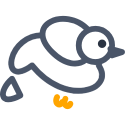
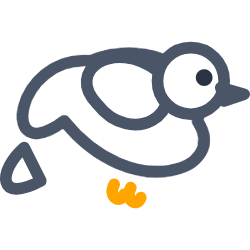

# Flappy Bird Oyunu (C# Windows Forms) 🕊️

 

Bu proje, popüler mobil oyun Flappy Bird'ün C# ve Windows Forms ile geliştirilmiş bir masaüstü versiyonudur. Proje, **Nesne Tabanlı Programlama** dersi kapsamında bir ödev olarak hazırlanmıştır.

[▶️ **İstersen indir (Son Sürüm)**](https://github.com/[KullaniciAdin]/[RepoAdin]/releases/latest)

---

## 📸 Önizleme


## 🚀 Özellikler

- **Basit Kontrol:** `Boşluk (Space)` tuşu ile kuşa zıplama yeteneği kazandırılır.
- **Dinamik Engeller:** Oyun alanında rastgele yüksekliklerde boru engelleri oluşturulur.
- **Hassas Çarpışma Tespiti:** Kuşun ve engellerin şeffaf olmayan pikselleri üzerinden çarpışma kontrolü yapılarak daha isabetli bir oyun deneyimi sunulur.
- **Skor Sistemi:** Başarıyla geçilen her engelde skor artırılır.
- **Oyun Sonu ve Yeniden Başlatma:** Oyun bittiğinde final skor gösterilir ve yeniden başlama imkanı tanınır.

## 🎨 Kullanılan Varlıklar

Oyunun görselleri SVG formatında hazırlanmıştır. Daha sonra PNG formatına çevrilmiştir. Kuş karakterinin animasyonu için iki farklı frame bulunmaktadır.

| Kuş (Kanat Yukarı) | Kuş (Kanat Aşağı) | Engel (Baş) | Engel (Gövde) |
|---------------------|-------------------|-------------|---------------|
|  |  |  |  |


## 💻 Kurulum ve Çalıştırma

### Hızlı Başlangıç (Oynamak İçin)

1. Projenin `Release` klasörüne gidin veya [son sürümü buradan indirin](https://github.com/BilalAbic/FlappyBird/releases/latest).
2. `FlappyBird.exe` dosyasına çift tıklayarak oyunu başlatın.

*Not: Çalışması için bilgisayarınızda .NET Framework yüklü olmalıdır.*

### Kaynak Koddan Çalıştırma

1. Projeyi bilgisayarınıza klonlayın.
   ```bash
   git clone https://github.com/BilalAbic/FlappyBird.git
   ```
2. `.sln` uzantılı dosyayı **Visual Studio** ile açın.
3. `F5` tuşuna basarak projeyi derleyin ve başlatın.

## 📄 Lisans
Bu proje Apache 2.0 Lisansı altında dağıtılmaktadır.
